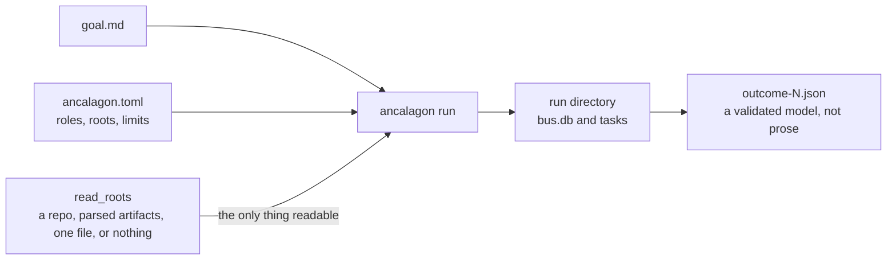
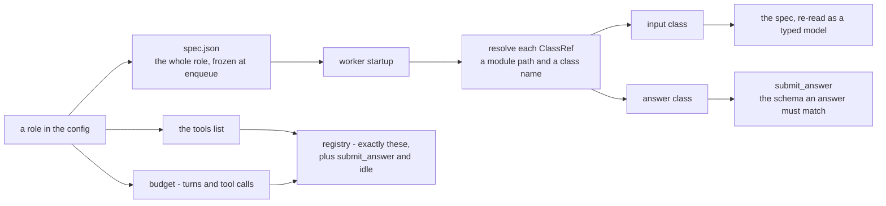
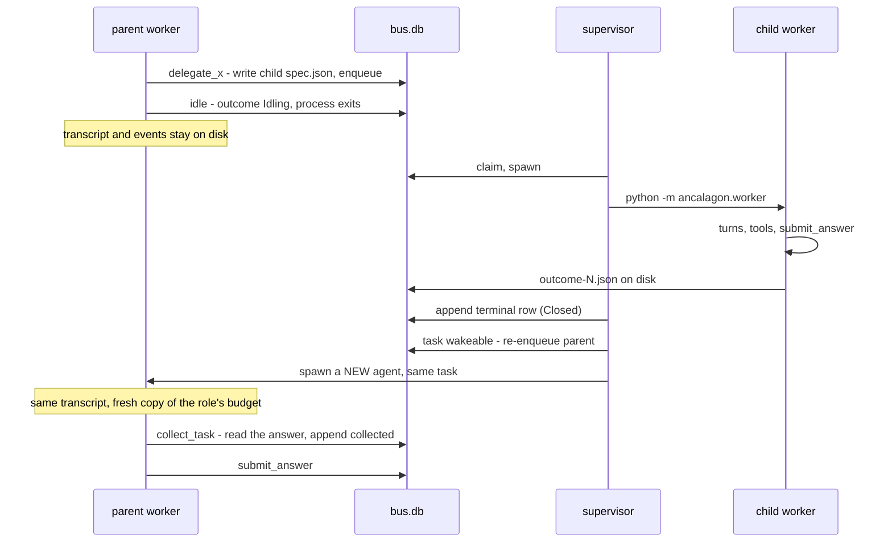
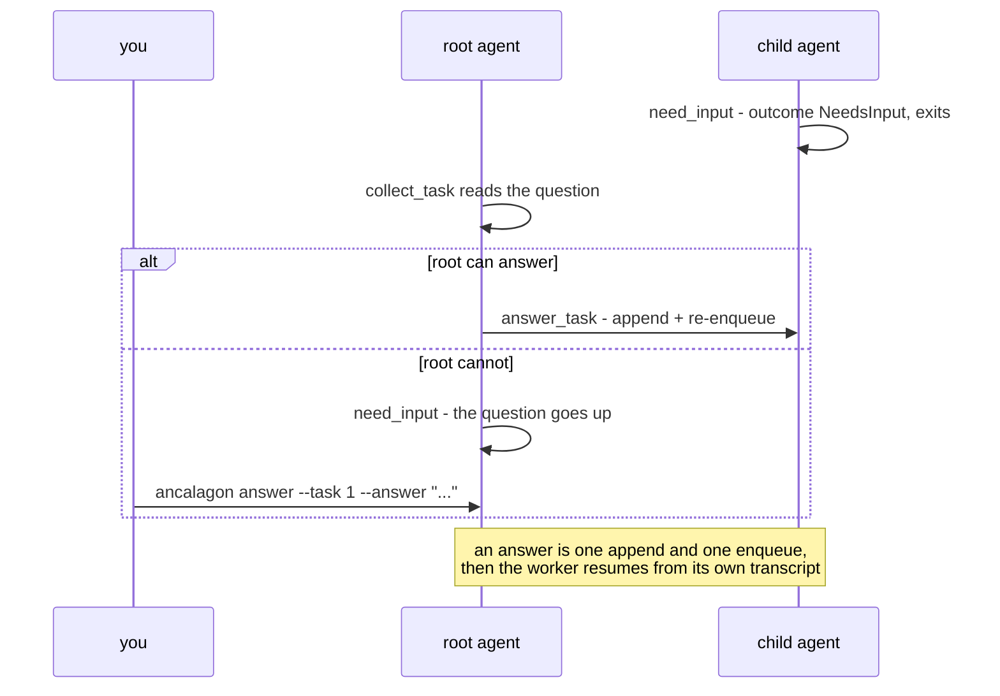
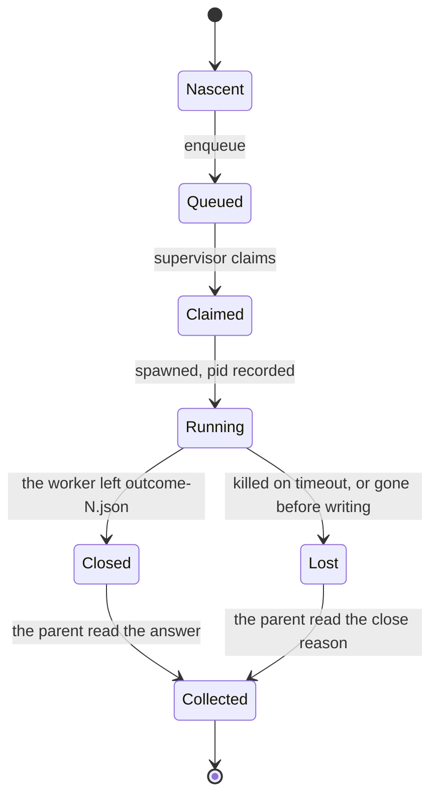
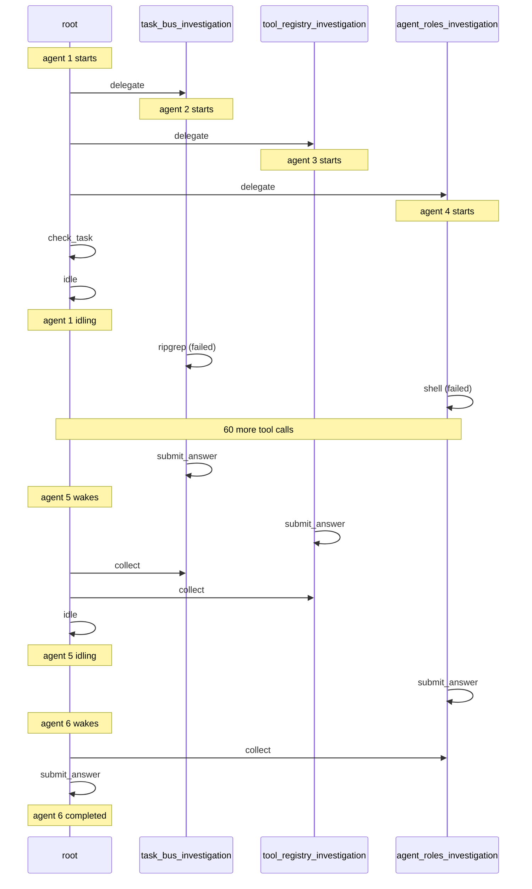
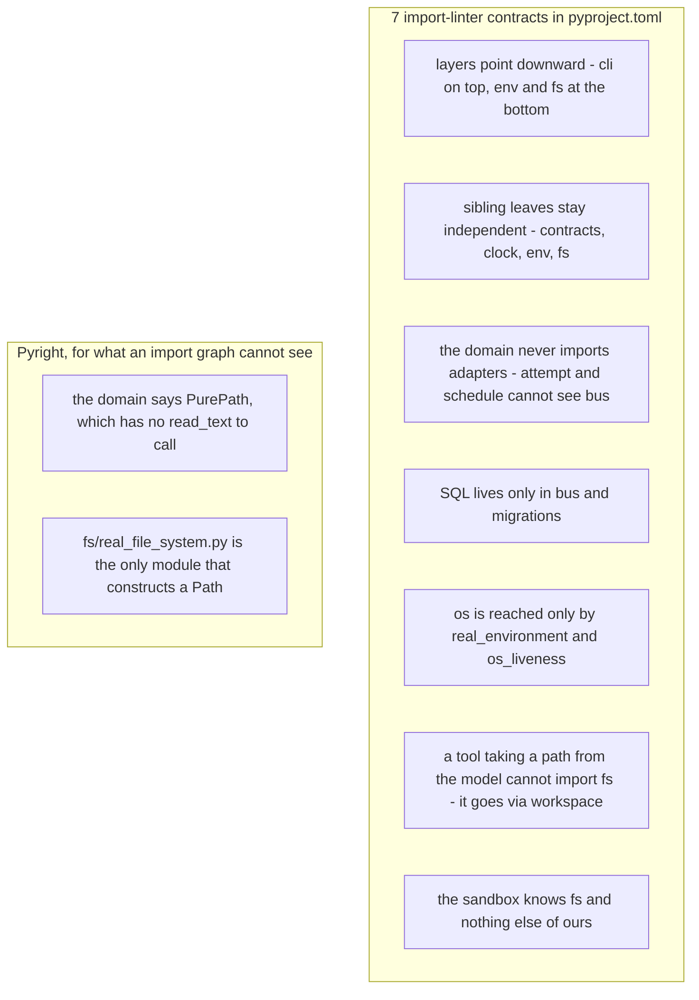

# Ancalagon

There are many agent harnesses, but this one is mine.
**Ancalagon** is an agent harness with a typed contract-first approach.

Give it a goal. An agent pursues it with tools — ripgrep, ast-grep, tree-sitter queries,
stream-only `sed`, a shell, scoped file access — and delegates focused subtasks to isolated
subagent processes, each with its own budget and its own typed answer contract.



`read_roots` is the whole boundary: point it at a repository, a directory of parsed artifacts,
a single file, or nothing at all, and the agent stays inside it. A child's answer shape comes
from a role declared before the run starts, so a fan-out yields structured data because the
contract was decided up front rather than guessed mid-run.

## Running

```bash
uv sync
cp ancalagon.example.toml ancalagon.toml   # edit write_root, read_roots and goal_file
echo "..." > goal.md
RUN_DIR=$(uv run ancalagon init --config ancalagon.toml)
uv run ancalagon migrate --db "$RUN_DIR/bus.db"
uv run ancalagon run --config ancalagon.toml --run-dir "$RUN_DIR"
```

Three separate commands, because a schema upgrade belongs to the startup script and not to a
side effect of starting a run.

| Command | Does | Refuses |
|---|---|---|
| `init` | allocates `<write_root>/runs/r_YYYYMMDD-HHMMSS` from the UTC clock and prints it, or creates the directory given to `--run-dir` | an allocated directory that already exists |
| `migrate` | brings that run's database to the latest schema, creating it if absent | — |
| `run` | starts or continues the run in `--run-dir` | a database that is absent or out of date, naming the command that fixes it |
| `answer` | appends your answer to a stopped agent and re-queues its task | a task with no `needs_input` in its history, or one with a live agent |

`scripts/ancrun.zsh <config.toml> [run-dir]` does the first three. With no run directory it
allocates a fresh one; pass an existing one to continue that run.

## How it works

Three kinds of process. They share no memory and there is no IPC — every hand-off is a SQLite
row or a file.


- **Supervisor** — spawns, reaps, kills on timeout. Never retries: a crash is reported and the
  parent decides. The only module that constructs `Popen`.
- **Worker** — one process, one agent, one attempt at one task.
- **Session** — one turn at a time against the provider, with the tools its role named.

## Roles

Everything an agent *is* — behaviour, input shape, answer shape, tools, budget — is a role in
the config. Nothing about an agent is authored at runtime.

```toml
[roles.root]
behaviour = "You investigate a codebase or a set of artifacts to answer the goal you are given."
tools = ["read_file", "ripgrep", "ast_grep", "list_dir", "delegate_component_analyst", "collect_task"]
budget = { turns = 20, tool_calls = 60 }

[roles.component_analyst]
behaviour = "Read before concluding. Cite the files you read."
input  = { module = "./shapes.py", name = "ComponentQuery" }
answer = { module = "./shapes.py", name = "Component" }
tools  = ["read_file", "ripgrep", "find_symbol"]
budget = { turns = 12, tool_calls = 30 }

[run]
goal_file = "./goal.md"
input_file = ""      # validated against the root role's input class; empty + FreeText means {"text": goal}
role = "root"
```

The root is a role like any other; `[run] role` names which one it runs as, and its goal comes
from a file because it has no parent to call `delegate` on it.



Rules that follow from that wiring:

- Omitting `input` or `answer` means `FreeText` — that is how a role opts into prose.
- A role a worker may spawn gets a `delegate_<role>` tool built from *that role's* input
  contract, so a parent sees the child's real schema. A worker builds them only for the roles
  its own `tools` list names. A role name becomes a tool name, so it must be a Python identifier.
- `tools = []` means *no tools*, not all of them. `submit_answer` and `idle` arrive regardless.
- There is no global default budget or tool list. Only what each role states.
- A `spec.json` freezes the role at enqueue, so editing `[roles.*]` affects only tasks queued
  afterwards. The freeze is not total: the contract *source* is a path, so editing
  `shapes.py` changes the shape a resumed run works to.

Three things are checked before any agent starts, each exiting 2 with the reason: a missing or
empty `goal_file`, a `[run] role` no `[roles.*]` declares, and a contract module that does not
exist or does not parse — named with the role and the path, rather than crashing a worker later.

The harness does not check that a role graph makes sense:

| Role holds | But lacks | Consequence |
|---|---|---|
| `delegate_x` | `collect_task` | can spawn children it can never read, and `submit_answer` stays withheld — it always runs out its budget and finishes `Exhausted` |
| — | `answer_task` | children that call `need_input` wait until they time out |

`load_config` reads each field it needs by name, so a missing one fails loudly. It never
validates the whole document, so a stale `[agent]`, `[tools]` or `[budget]` section from before
roles existed loads silently and is ignored. Nothing will tell you it is dead weight.

## Delegating, and what a parent does while it waits

A parent does not poll. It idles, its process exits, and the supervisor brings it back once a
child settles.



- Resumption is a **new agent** against the same task. A parent that idles waiting on three
  children may spend four budgets across the run, not one. That cost lands on the parent's
  role, which is where every other budget decision lives.
- `check_task` reports a child's status without waiting or spending a turn.
- `collect_task` needs the child *closed by the supervisor*, not merely finished — a child
  whose process is still exiting is not yet collectable, and says so. A child the supervisor
  had to kill is still collectable: the outcome is read from the bus event that closed it,
  since no file was ever written.

Which of the two terminal tools the session offers is decided per turn:

| Turns left? | Children outstanding | Children settled but uncollected | Offered |
|---|---|---|---|
| yes | none | none | `submit_answer`, no `idle` |
| yes | some | — | `idle`, no `submit_answer` |
| yes | none | some | neither — `collect_task` first |
| no (final turn) | none | any | `submit_answer` only, forced |
| no (final turn) | some | — | nothing is offered: the attempt ends `Idling` |

## Asking a human

A subagent that needs input stops rather than blocking, so nothing is held open and a dead
child cannot hang its parent. Questions bubble up; answers flow down.



```bash
ancalagon answer --run-dir ws/runs/r_20260822-121500 --task 1 --answer "keep both captions"
ancalagon run --config ancalagon.toml --run-dir ws/runs/r_20260822-121500   # same run dir; picks it up
```

Meanwhile the other children keep working, so by the time you answer, their results are waiting.

## The lifecycle of one attempt

Nothing is ever updated. Every status is a new row, and the current state is a fold over an
agent's whole history.



| Terminal state | Verdict recorded | Written by |
|---|---|---|
| `Closed` | `completed`, `exhausted`, `failed`, `needs_input`, `idling` | the worker's own word, carried into the row |
| `Lost` | `crashed`, `timed_out` | the supervisor's own observation |

- Only the worker writes `outcome-<agent>.json`; only the supervisor writes a row about what
  happened to an agent, and exactly one terminal row per agent. `Closed` means an answer exists
  on disk, `Lost` means it does not — decided by a check, never assumed from the newest row.
- `LifecycleStore.record` refuses a transition this diagram does not allow, so an impossible
  sequence fails where it is written rather than later, at whichever predicate first disagrees.
- It never retries. A crash is reported; the parent decides.

`docs/architecture.md` has the states in full, and the reasoning.

## What a run leaves behind

```
ws/runs/r_20260822-121500/
    bus.db                        tasks, agents, an append-only event log, model calls
    tasks/<task_id>/
        spec.json                 what was asked, with the whole role embedded
        transcript.jsonl          every message, one per line, tagged by agent id
        outcome-<agent>.json      the result of that attempt, kept even when superseded
        stderr-<agent>.log        the worker's stderr
        tools/0000-read_file.txt  every tool's full output
```

Resumption is not a mode: a worker loads whatever transcript is already in its directory. Point
it at an existing directory to continue with history; give a new directory the same spec for a
clean retry. Transcripts are flushed per message, so a killed agent still leaves a readable
partial history — which is what makes resumption possible at all.

## Inspecting a run

Everything is on disk and in one SQLite file. There is no `ancalagon usage` verb; the schema is
the query surface.

A finished or running run can be read as a graph. `trace` emits `{nodes, edges}` JSON — tasks,
agent attempts and tool calls, joined by `spawned`, `woke`, `called`, `delegated` and `collected`
edges, each stamped with when it happened. `viz` turns that into a Mermaid sequence diagram with
one lane per task. They are separate so the data outlives this one way of drawing it:

```bash
ancalagon trace --run-dir ws/runs/r_20260822-121500 | ancalagon viz > run.mmd
ancalagon trace --run-dir ws/runs/r_20260822-121500 --output run.json   # or keep the graph
ancalagon viz --input run.json --output run.mmd
```

Both write to stdout when no `--output` is given, and `viz` reads stdin when no `--input` is.
Neither writes anything into the run directory.

Abridged, that is what a fan-out actually looked like — three children, a parent that idles
rather than polls, and two wakes to collect them:



```bash
sqlite3 ws/runs/r_20260822-121500/bus.db \
  "select agent, status, source, summary from agent_events order by id"

sqlite3 -json ws/runs/r_20260822-121500/bus.db \
  "select agent, model, sum(prompt_tokens), sum(completion_tokens),
          sum(cache_creation_tokens), sum(cache_read_tokens)
   from model_calls group by agent"

rg '"agent": 17' ws/runs/r_20260822-121500/tasks/*/transcript.jsonl
tail -f ws/runs/r_20260822-121500/tasks/root/transcript.jsonl
```

Model calls have their own store, `MeterStore`, behind the `Meter` a session calls — a separate
concern from the lifecycle rows, sharing the run's one connection rather than a second database.
Tokens are recorded; money is not. A price list changes without notice, and a figure computed at
one week's prices is silently wrong the next.

Watch a whole run, subagents included:

```bash
./scripts/ancwatch.zsh ancalagon.toml    # start before or during a run
```

Give it the config the run uses, so the two cannot disagree about where runs live. It sees only
`<write_root>/runs/*/tasks/*` and `<write_root>/*/tasks/*` — a run directory elsewhere is
invisible to it.

## Sandbox, credentials, migrations

- Runs are sandboxed by default: every worker is wrapped with `fence`
  (`brew install fencesandbox/fence/fence`). `[sandbox] strategy = "none"` opts out.
- The sandbox confines **writes** to `write_root`. It does not restrict reads, so a sandboxed
  agent can still read anything you can. On macOS, fence also grants an implicit write
  carve-out for the whole `$TMPDIR` tree regardless of policy — a known limitation, not ours.
- The `shell` tool hands a command line to `/bin/sh`, pipes and globs included, so the sandbox is
  what bounds it rather than the argument. Under fence it may read widely but cannot write
  outside the run or reach an unlisted domain; under `strategy = "none"` an agent holding `run`
  has whatever access you have. It runs in a directory the call must name, resolved against
  `read_roots`, and is killed after 120 seconds.
- On Bedrock with a bearer token, `scripts/ancrun.zsh` strips stale AWS credentials from the
  environment first — otherwise litellm signs with those and Bedrock rejects the request. It
  requires `AWS_BEARER_TOKEN_BEDROCK`.
- `ancalagon migrate --db <db> --to 0` drops every table the schema creates, not just what a
  later migration added; there is only the one. A parent's `idling` row and a child's
  `collected` row go with the rest of `agent_events`.

## Constraints

Pyright strict, no `Any`, no `object`, no JSON-blob types — JSON is text until
`model_validate_json` makes it a concrete model. One class per module. No comments beyond a
one-line header. See `CLAUDE.md`.

The architecture is machine-checked rather than reviewed, and both of these fail the build:



## Testing

```bash
uv run pytest tests/unit          # no network
uv run pytest tests/integration   # spawns real worker subprocesses
ANCALAGON_LIVE=1 uv run pytest tests/integration            # also calls a real model
ANCALAGON_LOCAL_MODEL=ollama_chat/qwen2.5:14b uv run pytest tests/integration
```

The integration suite's offline tests exercise the whole pipeline — CLI, bus, supervisor, worker
subprocess, outcome and stderr capture — without a credential.
`tests/integration/scripted_model.py` serves an OpenAI-shaped endpoint from a script keyed on
each agent's goal, so real worker processes run an exact sequence:
`test_scripted_escalation.py` runs a whole delegate-ask-escalate-answer-resume cycle in nine
seconds, deterministically.

The two gated tests answer different questions. `ANCALAGON_LIVE` asks whether a funded model can
do the work. `ANCALAGON_LOCAL_MODEL` asks whether a real provider accepts a resumed transcript —
one ending in an answer to a question the agent asked — and carries on from it. No fake can
settle that, and a local model settles it for free.

## Design

- `docs/architecture.md` — one run through every file it touches, in order. Start here to read
  the code.
- `docs/superpowers/specs/2026-08-02-ancalagon-agent-harness-design.md` — the rationale: what
  was chosen, what was cut, and why.
