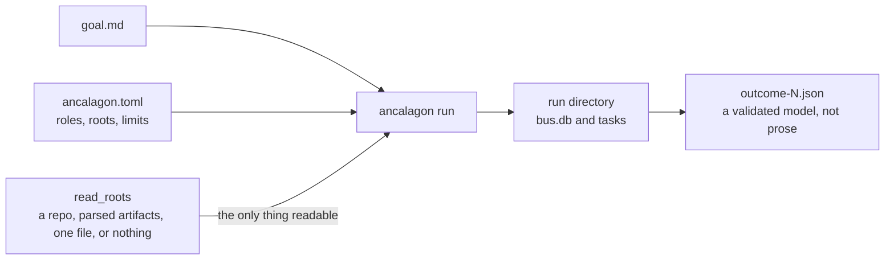
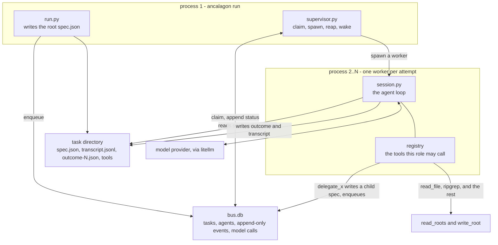
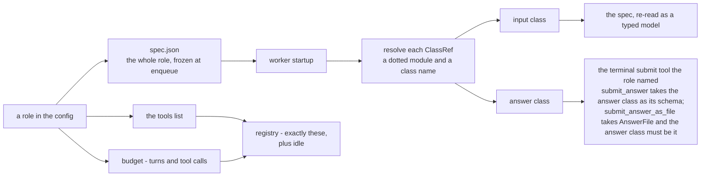
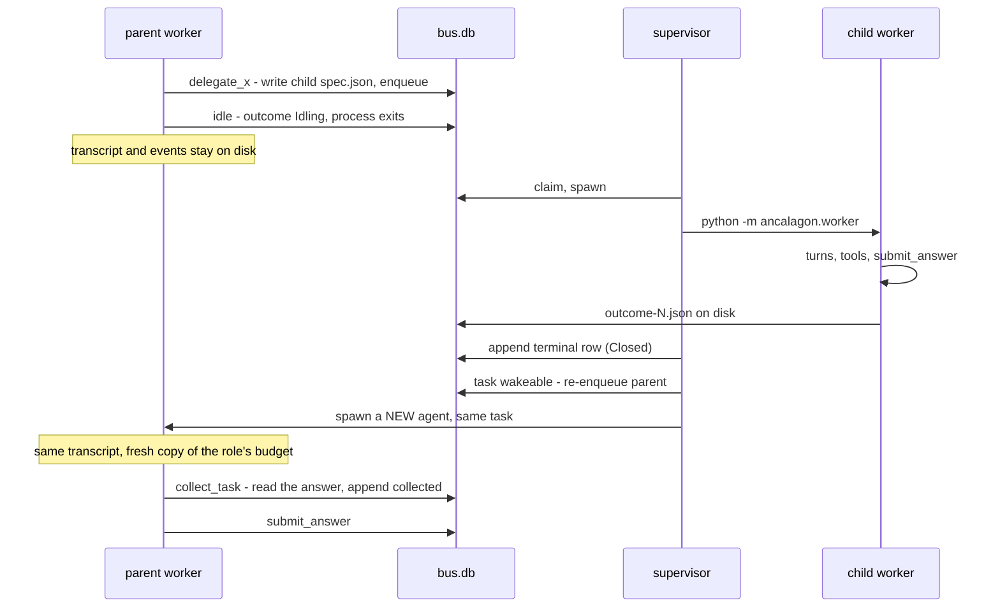
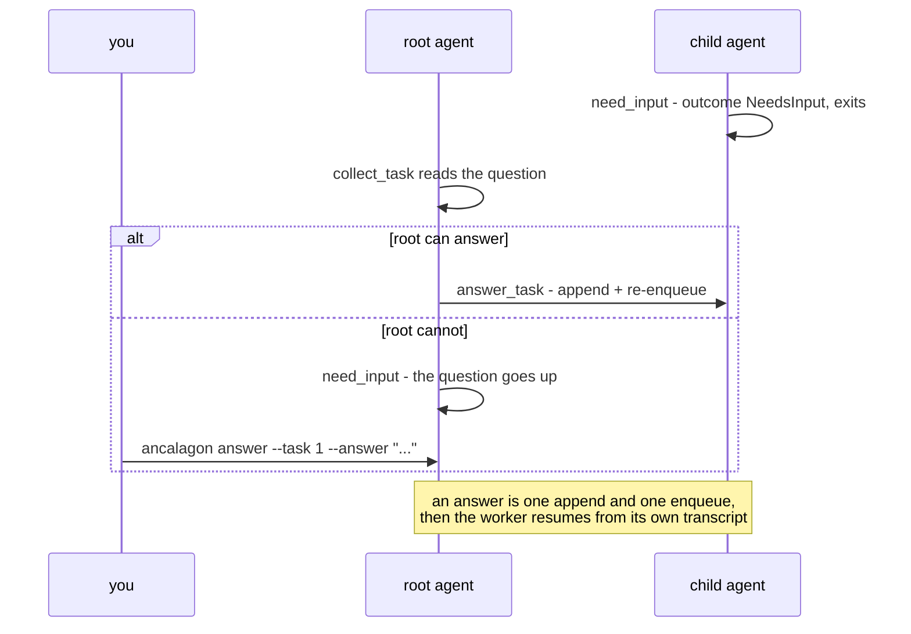
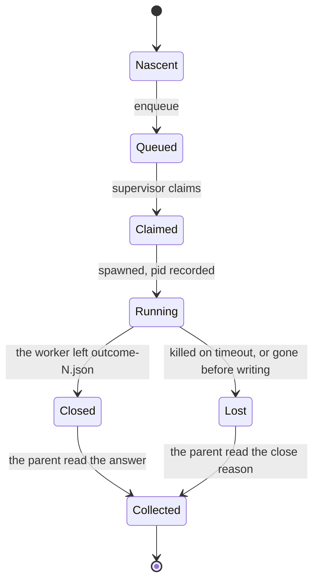
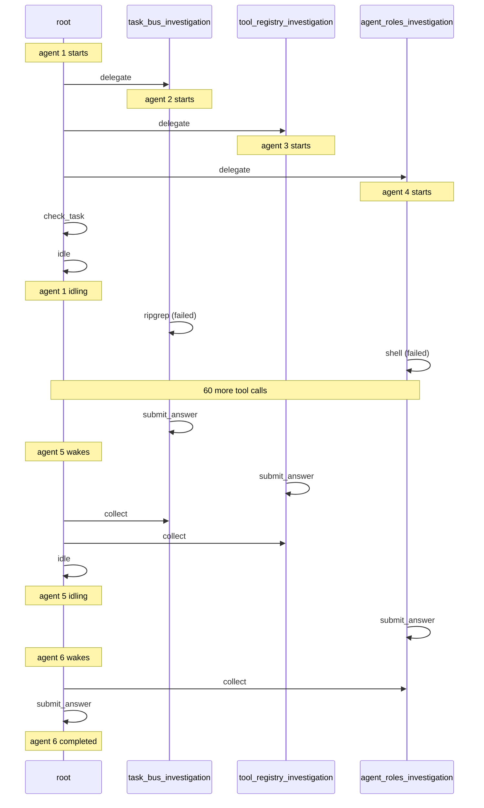
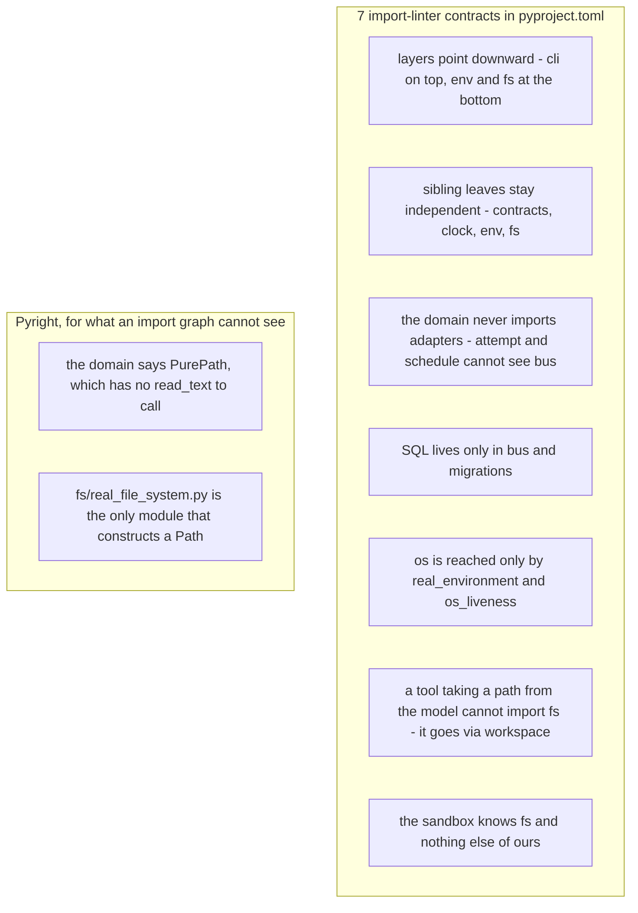

# Ancalagon

There are many agent harnesses, but this one is mine.
**Ancalagon** is an agent harness with a typed contract-first approach.

Give it a goal. An agent pursues it with [tools](#the-tools) — ripgrep, ast-grep,
tree-sitter queries, a shell, transformed reads, appendable and scoped file access — and
delegates focused subtasks to isolated subagent processes, each with its own budget and its
own typed answer contract.



`read_roots` is the whole boundary: point it at a repository, a directory of parsed artifacts,
a single file, or nothing at all, and the agent stays inside it. A child's answer shape comes
from a role declared before the run starts, so a fan-out yields structured data because the
contract was decided up front rather than guessed mid-run.

## Running

```bash
uv sync
cp ancalagon.example.toml ancalagon.toml   # edit write_root, read_roots and goal_file
echo "..." > goal.md
RUN_DIR=$(uv run ancalagon init --config ancalagon.toml)
uv run ancalagon migrate --db "$RUN_DIR/bus.db"
uv run ancalagon run --config ancalagon.toml --run-dir "$RUN_DIR"
```

Three separate commands, because a schema upgrade belongs to the startup script and not to a
side effect of starting a run.

| Command | Does | Refuses |
|---|---|---|
| `init` | allocates `<write_root>/runs/r_YYYYMMDD-HHMMSS` from the UTC clock and prints it, or creates the directory given to `--run-dir` | an allocated directory that already exists |
| `migrate` | brings that run's database to the latest schema, creating it if absent | — |
| `run` | starts or continues the run in `--run-dir` | a database that is absent or out of date, naming the command that fixes it |
| `answer` | appends your answer to a stopped agent and re-queues its task | a task with no `needs_input` in its history, or one with a live agent |
| `note` | leaves a note in a running task's letterbox, read at its next turn | empty text, or an agent the run has never heard of |
| `trace` | emits a finished or running run as a graph of nodes and edges | — |
| `viz` | renders that graph as a Mermaid sequence diagram | — |

`scripts/ancrun.zsh <config.toml> [run-dir]` does the first three. With no run directory it
allocates a fresh one; pass an existing one to continue that run.

Two worked configs ship with the repo, each with its goal file beside it. Run any of them
the same way, in place of `ancalagon.toml`:

| Config | Shows |
|---|---|
| `research.toml` | `web_search` and `fetch_url`, with every role answering by writing a file |
| `blackboard.toml` | three peers sharing one append-only file, waking each other through `watch_file` |

One worked example does not use a config file at all:

| Example | Shows |
|---|---|
| `examples/embed_one_agent.py` | [one agent inside a host program](#running-one-agent-in-your-process), with a `Config` built in Python and no supervisor |

## Starting a run from Python

`ancalagon run` is one caller of a seam any program can use. Before calling `run`, the run
directory must exist and its `bus.db` must be migrated to the latest schema — `ancalagon init`
and `ancalagon migrate` do this for the CLI; a Python caller does it directly:

```python
from ancalagon.migrations import latest_version, migrate_file
from ancalagon.run import run

fs = RealFileSystem()
run_dir.mkdir(parents=True, exist_ok=True)
migrate_file(run_dir / "bus.db", latest_version(fs), fs)
produced = run(config, run_dir, SystemClock(), fs)
```

`run` takes a `Config` and returns the root's `Outcome`, parsed against the answer class its role
declared. A `Config` comes from `load_config` for a TOML file, from `Config.model_validate_json`
for a JSON one, or from Python directly — the conversion layer sits above the run, and nothing
below it knows a format exists.

A `Config` built in Python must set `import_paths` to the directories its contract classes and
hook functions live under. `load_config` sets it to the config file's own directory. If a worker
fails with a module error naming a module the host can import itself, `import_paths` is unset —
validation runs in the host process, where that import succeeds.

## Running one agent in your process

`run` starts a whole tree. To run a single agent in your own process, with no subprocess and no
database, assemble its session directly:

```python
from ancalagon.session_for import session_for

session = session_for(config, spec, ctx, transcript, run_dir, llm, clock, fs, web)
outcome = session.run()
```

The caller owns the `ToolContext` and the `Transcript`, and closes the transcript when it is done.
`examples/embed_one_agent.py` is the worked version of this section: it builds all four from a
`Config` written in Python, hands one agent `list_dir`, `read_file` and `submit_answer`, and sets
it to find the contradiction among four notes. Run it with `uv run python examples/embed_one_agent.py`
once your provider credentials are in the environment, and change `MODEL` at the top of the file to
point at a different one. `tests/integration/test_one_agent.py` is the same shape with a scripted
model and no network.

The remaining collaborators default to `NO_BUS`, `NO_CHILDREN`, `NO_LETTERBOX` and `UNMETERED`,
which is what makes one agent run alone: a role naming `delegate_<role>` or `idle` gets a tool of
the same name and schema whose every call refuses. `watch_file` is not among them, because it is
offered at all only when some role declares `watch_for` as its `run` function; a solo agent that
names it fails at startup like any unknown tool, as described under [the tools](#the-tools).

`session.run()` does not raise. A provider that dies, a tool that throws, anything else the loop
does not expect: each comes back as a `Failed` outcome carrying the traceback in `error` and the
turns and tool calls actually spent. A host switches on the outcome rather than wrapping the call.
`KeyboardInterrupt` and `SystemExit` still propagate.

Three things fail later than you would like:

- The task directory must sit under `config.write_root`. Tool output goes through the workspace,
  so a directory outside it raises `ScopeError` at the first tool that writes, naming the tool
  rather than the wiring.
- `on_path(config.import_paths)` must run before `session_for`. Building a `delegate_<role>` tool
  imports that role's input contract, so a config built in Python whose `import_paths` are unset
  fails with a module error naming a module the host can import itself.
- `depth` defaults to `0`, which is a decision rather than a placeholder: `build_registry`
  withholds `delegate_<role>` once `depth` reaches `config.max_depth`.

## How it works

Three kinds of process. They share no memory and there is no IPC — every hand-off is a SQLite
row or a file.



- **Supervisor** — spawns, reaps, kills on timeout. Never retries: a crash is reported and the
  parent decides. The only module that constructs `Popen`.
- **Worker** — one process, one agent, one attempt at one task.
- **Session** — one turn at a time against the provider, with the tools its role named.

## Roles

Everything an agent *is* — behaviour, input shape, answer shape, tools, budget — is a role in
the config. Nothing about an agent is authored at runtime.

```toml
[roles.root]
behaviour = "You investigate a codebase or a set of artifacts to answer the goal you are given."
tools = ["read_file", "ripgrep", "ast_grep", "list_dir", "delegate_component_analyst", "collect_task"]
budget = { turns = 20, tool_calls = 60 }

[roles.component_analyst]
behaviour = "Read before concluding. Cite the files you read."
input  = { module = "shapekit.shapes", name = "ComponentQuery" }
answer = { module = "shapekit.shapes", name = "Component" }
tools  = ["read_file", "ripgrep", "find_symbol"]
budget = { turns = 12, tool_calls = 30 }

[run]
goal_file = "./goal.md"
input_file = ""      # validated against the root role's input class; empty + FreeText means {"text": goal}
role = "root"
```

A budget field takes a number or the string `"infinite"`, and the two may be mixed:
`budget = { turns = "infinite", tool_calls = 200 }` runs until the agent answers or spends its
two hundredth tool call. An infinite field is never spent down and never exhausts, so nothing
stops that agent but its own answer and `[limits] agent_timeout_s`. A budget is written
into a task's `spec.json` in that same form -- a number, or `"infinite"` -- while code
constructing a `Budget` states `Finite` or `Infinite` outright. What an agent spent is
counted as it works, so an outcome reports real turns and tool calls either way.

The root is a role like any other; `[run] role` names which one it runs as, and its goal comes
from a file because it has no parent to call `delegate` on it.



Rules that follow from that wiring:

- Omitting `input` or `answer` means `FreeText` — that is how a role opts into prose.
- A role a worker may spawn gets a `delegate_<role>` tool built from *that role's* input
  contract, so a parent sees the child's real schema. A worker builds them only for the roles
  its own `tools` list names. A role name becomes a tool name, so it must be a Python identifier.
- `tools = []` means *no tools*, not all of them. `idle` arrives regardless; a terminal submit
  tool does not — a role that runs a session names one, and `check_contracts` rejects a role
  that names none. There is one way out of a run and the role chooses which.
- There is no global default budget or tool list. Only what each role states.
- The config is fixed for the duration of one `run()` invocation: it is materialised into
  `config.json` in the run directory, and every worker reads that copy rather than the source
  TOML. Editing `[roles.*]`, the model or the limits therefore affects the next invocation, not
  the next worker spawned. What still varies within a run is the contract *source*: a dotted
  module is resolved fresh each time a worker starts, so editing `shapekit/shapes.py` changes
  the shape a resumed run works to.
- A config file's own directory goes on the import path when it loads, so a package sitting
  beside the TOML — `shapekit/` next to this file — resolves by its dotted name, `shapekit.shapes`.

Four things are checked before any agent starts, each exiting 2 with the reason — named with the
role and the module, rather than crashing a worker later. A missing or empty `goal_file`. A
`[run] role` no `[roles.*]` declares. A contract or hook whose module and name do not match the
dotted-reference pattern, or whose module fails to import. And every hook a role declares,
including whether the tool it is attached to can hand it what it asks for.

A role may also wrap any tool it uses with a **hook** — a function that sees a call before it
runs, or its result after, and accepts it, rewrites it, or refuses it:

```toml
[roles.component_analyst.before]
submit_answer = [
  { module = "checkkit.checks", name = "cites_real_files" },
  { module = "checkkit.checks", name = "no_absolute_paths" },
]

[roles.component_analyst.after]
ripgrep = [{ module = "checkkit.checks", name = "must_have_found" }]
```

```python
def cites_real_files(answer: Component, ctx: ToolContext) -> Reviewed:
    missing = [f for f in answer.files if not ctx.workspace.exists(f)]
    if missing:
        return Refused(reason=f"these cited files do not exist: {missing}")
    return Accepted(value=answer)
```

Every tool carries a composite of both kinds, empty unless the role names one. Hooks run in the
order declared, each seeing what the one before it returned, and the first refusal stops the
chain — so an empty composite is simply a passthrough and there is no separate no-hook case.

A refusal is not a crash. The agent is told the reason on its next turn and tries again within
its budget, on the same path a malformed argument already takes — so deterministic criteria an
answer must meet become part of the loop rather than a check after it. `ctx.input` is what the
task was given, so a hook can compare an answer against the question. The two hooks are
independent; declare either or both.

Hooks are matched to their tools before the run starts. A function taking `SedArgs` cannot be
attached to `ripgrep`, while one taking `BaseModel` can be attached to anything. A hook named for
a tool the role does not use is rejected too, so a typo checks nothing quietly.

A refusal on the forced last turn is the one case with no retry left. The attempt ends `Failed`
naming the refusal, with the rejected arguments kept as the summary, so a parent is told what
actually happened rather than being handed an answer that never met its criteria.

One hook ships with the harness, because every analysis wants it. An answer contract that
inherits `ancalagon.contracts.cited.Cited` implements `citations()`, returning the
`ancalagon.contracts.evidence.Evidence` values it rests on — a path, a line range, and those
lines quoted verbatim. `read_file` numbers every line it returns, so a range is copied from what
the tool printed rather than counted. Attaching `evidence_resolves` to `submit_answer` reads each cited file
through the workspace and refuses the answer unless every quote matches the lines it names,
listing all the faults at once:

```toml
[roles.component_analyst.before]
submit_answer = [
  { module = "ancalagon.tools.submit.evidence_resolves", name = "evidence_resolves" },
]
```

A citation that names an unreadable path, an inverted range, a range past the end of the file, or
lines whose text differs is a refusal, so a claim the model invented cannot leave the loop looking
like one it read. A quote that differs is shown as an alignment rather than described, because
"does not match" leaves the model guessing which of its lines was wrong:

```
/scope/record.txt: quote does not match lines 2-3. Rows are = same, - only in your quote, + only in the file, numbered quote:file.
= 1:2 05  FIRST-FIELD    PIC X(01).
- 2:- 05  INVENTED  PIC X.
+ -:3 05  SECOND-FIELD   PIC X(1).
```

A role whose input contract inherits `ancalagon.contracts.schema_guided.SchemaGuided` names an
output schema file in its input, describing the structure its answer must satisfy. Attaching
`adheres_to_schema` to `submit_answer_as_file` reads the answer file and checks it against the
schema, reporting every fault at once:

```toml
[roles.record_analyst.before]
submit_answer_as_file = [
  { module = "ancalagon.tools.submit.adheres_to_schema", name = "adheres_to_schema" },
]
```

Hooks compose in order, so a role can follow this one with its own check of a property the schema
cannot express. A role wiring no hook submits an unchecked file — the check is opt-in by
declaration like every other hook.

### The tools

Every tool a role may name, and what it is for. `idle` arrives whatever the list says;
`delegate_<role>` appears once per role the config declares. The two costing nothing do not spend
the tool-call budget.

| Reading | |
|---|---|
| `read_file` | a slice of a file, every line numbered, told which lines it showed of how many |
| `list_dir` | what is in a directory |
| `diff_regions` | two line ranges aligned row by row, with both files' line numbers |
| `code_stats` | languages, file and line counts, before reading anything |
| `file_type` | what a file is, before assuming it is text |
| `transform_file` | a file read through a sed script, when it is hard to read as it stands |
| `query_json` | a jq filter over JSON, so a large file need not enter the context |
| `edit_json` | change one place in a JSON file in the write root, so a large answer is built across many calls |
| `extract_strings` | printable text out of a binary |
| `convert_document` | docx, odt, epub, rtf and others, into text |

| Searching | |
|---|---|
| `ripgrep` | regular expression, `path:line:text` or JSON records |
| `ast_grep` | structural pattern, not text |
| `ast_query` | a tree-sitter query, returning each named capture with its exact range |
| `treesitter` | a whole file's AST nodes |
| `find_symbol` | where a symbol is defined, rather than every mention |
| `git_history` | why a file looks the way it does |

| Reaching the web | |
|---|---|
| `web_search` | ranked results for a query: title, URL and snippet |
| `fetch_url` | one https page's article text, with navigation and markup removed |

| Writing | |
|---|---|
| `write_file` | replace a file whole |
| `append_file` | add one line without reading, so a concurrent writer is not lost |
| `edit_file` | replace an exact substring |
| `delete_file` | remove a file |
| `shell` | a command line through `/bin/sh`, bounded by the sandbox and a timeout |

| Working with other agents | |
|---|---|
| `delegate_<role>` | queue a task for that role and return its id, without waiting |
| `check_task` | how a task is doing, free |
| `collect_task` | its answer, once the supervisor has closed it |
| `answer_task` | answer a child that stopped with a question |
| `watch_file` | queue a watcher that ends when a file changes, so idling wakes you |
| `need_input` | stop and hand a question upward, free |
| `idle` | stop and wait for a child, free |
| `submit_answer` | the final answer, free |
| `submit_answer_as_file` | the final answer as a file you already wrote, free — for a contract too large to emit in one reply |

### Two ways to submit

A role names one of two terminal tools: `submit_answer` carries the answer in its arguments, so
its parameter schema is the answer contract and the whole answer must fit in one completion;
`submit_answer_as_file` carries a status, a sentence and a path, so the answer is built on disk
across many `edit_json` calls and a parent collecting it pays three fields instead of the whole
record.

```toml
[roles.record_analyst]
answer = { module = "ancalagon.contracts.answer_file", name = "AnswerFile" }
tools = ["read_file", "write_file", "edit_json", "submit_answer_as_file"]
```

The `answer` line is not decoration: `submit_answer_as_file` submits an `AnswerFile` whatever the
role says, so a role naming that tool must declare `AnswerFile` as its `answer`, and startup
rejects one that declares something else. Naming both tools is legal and means the file route
replaces the other; only the named one is in the registry, so there is no second way out. A hook
declared for a tool the role does not name is rejected too, because a gate that never runs reads
as a gate that does.

`watch_file` is the one that needs something else declared: a role that names `watch_for` as its
`run` function, since that is what it queues and what tells the supervisor to run a process
rather than a session. The role's input contract follows from `watch_for`'s own signature, rather
than being stated separately. Naming `watch_file` without such a role fails at startup, as any
unknown tool does.

A deterministic role in full:

```toml
[roles.watcher]
behaviour = "Wait for the blackboard to change."
run = { module = "ancalagon.watch.watch_for", name = "watch_for" }
tools = []
budget = { turns = 0, tool_calls = 0 }
```

A run function takes two positional parameters — the first annotated with the input contract,
the second `RunContext` — and returns `Outcome[X]`, where `X` is the answer contract. The loader
reads the role's `input` and `answer` from that signature, so a role that declares `run` must not
also declare `input` or `answer`.

The function picks its own ending, the same way a session does: `Completed` when it has an
answer, `Idling` when it has spawned a child and wants to be woken once that child settles,
`NeedsInput` to ask its parent a question, `Failed` to report a failure it handled itself rather
than let escape. A deterministic agent spends no model turns, so it reports `spent=NOTHING`
whichever ending it returns.

There is no helper for spawning that child — a run function does what `DelegateTo.run` does:
`ctx.fs.mkdir` the child's task directory, write an `AgentSpec` to `spec.json` there with
`ctx.fs.write_text`, then open the bus at `ctx.run_dir / "bus.db"` and
`enqueue(child_dir, parent_agent=ctx.agent_id)`. Use `ctx.agent_id` exactly, not any other
value: waking matches a child to its parent by `parent_agent`, so a child enqueued under the
wrong id can never wake the task that spawned it. See "What being woken means" in
`docs/architecture.md` before relying on `Idling` — a woken run function is called again from
scratch, not resumed, so it must guard its own re-enqueuing the way `DelegateTo.run` and
`WatchFile._queued` guard theirs, with `active_for`.

An `Idling` a run function returns carries `seen_through`, and there is no session here to
fill it in. Give it the bus's largest event id, read from `ctx.run_dir / "bus.db"` before the
function decides to idle, and the function is woken only for a child that settled after that.
Give it `NO_WATERMARK` and it is woken for any child with an answer it has not collected,
including one that had already finished when it idled — a wake it can act on, and one that
stops once that child is collected or the last live child settles.

The child's role needs no entry in the config. Build one in Python from `Role`, `FunctionRef`,
`ClassRef` and `Budget`, the way `tests/integration/test_blackboard.py` does. Contract
derivation from a run function's signature is a config-loader concern, so a hand-built `Role`
must state its `input` and `answer` itself.

The harness does not check that a role graph makes sense:

| Role holds | But lacks | Consequence |
|---|---|---|
| `delegate_x` | `collect_task` | can spawn children it can never read, and `submit_answer` stays withheld — it always runs out its budget and finishes `Exhausted` |
| — | `answer_task` | children that call `need_input` wait until they time out |

`load_config` reads each field it needs by name, so a missing one fails loudly. It never
validates the whole document, so a stale `[agent]`, `[tools]` or `[budget]` section from before
roles existed loads silently and is ignored. Nothing will tell you it is dead weight.

## Delegating, and what a parent does while it waits

A parent does not poll. It idles, its process exits, and the supervisor brings it back once a
child settles.



- Resumption is a **new agent** against the same task. A parent that idles waiting on three
  children may spend four budgets across the run, not one. That cost lands on the parent's
  role, which is where every other budget decision lives.
- `check_task` reports a child's status without waiting or spending a turn.
- `collect_task` needs the child *closed by the supervisor*, not merely finished — a child
  whose process is still exiting is not yet collectable, and says so. A child the supervisor
  had to kill is still collectable: the outcome is read from the bus event that closed it,
  since no file was ever written.

Which tools the session offers is decided per turn:

| Turns left? | Children outstanding | Children settled but uncollected | Offered |
|---|---|---|---|
| yes | none | none | the terminal submit tool, no `idle` |
| yes | some | — | `idle`, not the terminal submit tool |
| yes | none | some | neither — `collect_task` first |
| no (final turn) | none | any | the terminal submit tool only, forced |
| no (final turn) | some | — | nothing is offered: the attempt ends `Idling` |

Whichever row applies, a reply that calls no tool at all is not an answer. The session tells the
agent that answers arrive only through the terminal submit tool and goes round again, and on the forced
final turn the attempt ends `Failed`. There is no route to a completed run that skips the tool,
which is what makes a hook attached to it a gate rather than one of two doors.

## Asking a human

A subagent that needs input stops rather than blocking, so nothing is held open and a dead
child cannot hang its parent. Questions bubble up; answers flow down.



```bash
ancalagon answer --run-dir ws/runs/r_20260822-121500 --task 1 --answer "keep both captions"
ancalagon run --config ancalagon.toml --run-dir ws/runs/r_20260822-121500   # same run dir; picks it up
```

Meanwhile the other children keep working, so by the time you answer, their results are waiting.

## Correcting an agent that is still running

An agent that has gone wrong in a way you can name in one sentence does not have to be killed.
Leave it a note and it reads it at the top of its next turn:

```bash
ancalagon note --run-dir ws/runs/r_20260822-121500 --agent 14 --text "send the nested fields as objects, not as JSON strings"
```

The note is written to `<task_dir>/notes/<stamp>.txt` and folded in as a user message prefixed
`Note from the operator:`, then deleted. Folding costs no turn and no tool call.

Three limits worth knowing. A note is addressed by agent number because that is what the log
prints, but it belongs to the **task** — if that agent has already exited, the next attempt on
the same task delivers it. A note to an agent idling on its children waits until something else
wakes it, since an idling agent runs no loop. And a note lands at the end of the context, which
is the strongest position an instruction can hold, but it removes nothing already there: it
catches drift early, it does not reform an agent that has spent its budget learning the wrong
shape.

## The lifecycle of one attempt

Nothing is ever updated. Every status is a new row, and the current state is a fold over an
agent's whole history.



| Terminal state | Verdict recorded | Written by |
|---|---|---|
| `Closed` | `completed`, `exhausted`, `failed`, `needs_input`, `idling` | the worker's own word, carried into the row |
| `Lost` | `crashed`, `timed_out` | the supervisor's own observation |

- Only the worker writes `outcome-<agent>.json`; only the supervisor writes a row about what
  happened to an agent, and exactly one terminal row per agent. `Closed` means an answer exists
  on disk, `Lost` means it does not — decided by a check, never assumed from the newest row.
- `LifecycleStore.record` refuses a transition this diagram does not allow, so an impossible
  sequence fails where it is written rather than later, at whichever predicate first disagrees.
- It never retries. A crash is reported; the parent decides.

`docs/architecture.md` has the states in full, and the reasoning.

## What a run leaves behind

```
ws/runs/r_20260822-121500/
    bus.db                        tasks, agents, an append-only event log, model calls
    tasks/<task_id>/
        spec.json                 what was asked, with the whole role embedded
        transcript.jsonl          every message, one per line, tagged by agent id
        outcome-<agent>.json      the result of that attempt, kept even when superseded
        stderr-<agent>.log        the worker's stderr
        tools/0000-read_file.txt  every tool's full output
```

Resumption is not a mode: a worker loads whatever transcript is already in its directory. Point
it at an existing directory to continue with history; give a new directory the same spec for a
clean retry. Transcripts are flushed per message, so a killed agent still leaves a readable
partial history — which is what makes resumption possible at all.

## Inspecting a run

Everything is on disk and in one SQLite file. There is no `ancalagon usage` verb; the schema is
the query surface.

A finished or running run can be read as a graph. `trace` emits `{nodes, edges}` JSON — tasks,
agent attempts and tool calls, joined by `spawned`, `woke`, `called`, `delegated` and `collected`
edges, each stamped with when it happened. `viz` turns that into a Mermaid sequence diagram with
one lane per task. They are separate so the data outlives this one way of drawing it:

```bash
ancalagon trace --run-dir ws/runs/r_20260822-121500 | ancalagon viz > run.mmd
ancalagon trace --run-dir ws/runs/r_20260822-121500 --output run.json   # or keep the graph
ancalagon viz --input run.json --output run.mmd
```

Both write to stdout when no `--output` is given, and `viz` reads stdin when no `--input` is.
Neither writes anything into the run directory.

`trace` reads a run once. To follow one as it happens, `watch` tails every agent's transcript in a
workspace and renders each message as it lands:

```bash
ancalagon watch --config ancalagon.toml          # one line per block, per agent
ancalagon watch --config ancalagon.toml --interval 0.5
ancalagon watch --dir ws                         # a workspace, without a config
ancalagon watch --dir ws/runs                    # or the runs directory itself
```

`--config` and `--dir` are alternatives and one is required. `--config` takes the workspace from
the config's `write_root` — resolved against the config file, not your shell's directory — so the
run and the watcher cannot disagree about where to look. `--dir` names a directory outright, and
accepts either a workspace or a `runs/` directory, for when you have a workspace in front of you
and no config to hand. A tool call's arguments are shown whole, never cut — they are the part of a
line worth reading, and a truncated one costs more to chase than a long one costs to skim. Prose
and tool results are still trimmed to the terminal. Agents already on disk when it starts are followed but their history is not
replayed; an agent that appears later is shown from its first message. Stop it with Ctrl-C.

It is **one process**, whatever the workspace holds. It stats every transcript each interval and
re-reads only the ones whose mtime moved — on a workspace of 22 transcripts that is 0.15 ms per
interval, against 14.5 ms to parse all of them. `scripts/ancwatch.zsh` does the same job with a
`tail` and a `jq` per transcript, which is 44 processes for that workspace and none of them ever
reaped.

**`ancalagon watch` is not `watch_file`.** The tool is how one agent waits on a file another agent
writes; this is how *you* watch the whole run from outside it. They share nothing but the word.

Abridged, that is what a fan-out actually looked like — three children, a parent that idles
rather than polls, and two wakes to collect them:



```bash
sqlite3 ws/runs/r_20260822-121500/bus.db \
  "select agent, status, source, summary from agent_events order by id"

sqlite3 -json ws/runs/r_20260822-121500/bus.db \
  "select agent, model, sum(prompt_tokens), sum(completion_tokens),
          sum(cache_creation_tokens), sum(cache_read_tokens)
   from model_calls group by agent"

rg '"agent": 17' ws/runs/r_20260822-121500/tasks/*/transcript.jsonl
tail -f ws/runs/r_20260822-121500/tasks/root/transcript.jsonl
```

`scripts/anccost.zsh <config.toml | dir>` is that query rolled up, as JSON, and
`scripts/anccosttable.zsh` renders it:

```bash
./scripts/anccost.zsh ancalagon.toml | ./scripts/anccosttable.zsh
./scripts/anccost.zsh ancalagon.toml | ./scripts/anccosttable.zsh --by-agent
./scripts/anccost.zsh ancalagon.toml | jq '.runs[].agents | max_by(.prompt)'

./scripts/anccost.zsh ancalagon.toml --output cost.json    # or keep the report
./scripts/anccosttable.zsh --input cost.json --output cost.txt
```

Both write to stdout when no `--output` is given, and `anccosttable` reads stdin when no
`--input` is — the same convention `trace` and `viz` follow.

Split the way `trace` and `viz` are: one reports what was spent and decides nothing about
how to show it, the other decides only that. `anccost` reads `write_root` from a config
exactly as `ancwatch.zsh` does, so the two cannot disagree about where runs live.

Model calls have their own store, `MeterStore`, behind the `Meter` a session calls — a separate
concern from the lifecycle rows, sharing the run's one connection rather than a second database.
Tokens are recorded; money is not. A price list changes without notice, and a figure computed at
one week's prices is silently wrong the next.

Watch a whole run, subagents included:

```bash
./scripts/ancwatch.zsh ancalagon.toml    # start before or during a run
```

Give it the config the run uses, so the two cannot disagree about where runs live. It sees only
`<write_root>/runs/*/tasks/*` and `<write_root>/*/tasks/*` — a run directory elsewhere is
invisible to it.

One line per message, rendered by `scripts/ancwatch.jq`. Prose and tool output are cut to the
terminal's width less the label; a tool call's arguments are shown whole, because a path cut in
half says less than the width saves. Widen the window to see more. The tool's name is bold yellow
and a failed result's `ERR` is red, so a scan finds what was called and what broke without reading
the line.

## Sandbox, credentials, migrations

- Runs are sandboxed by default: every worker is wrapped with `fence`
  (`brew install fencesandbox/fence/fence`). `[sandbox] strategy = "none"` opts out.
- The sandbox confines **writes** to `write_root`. It does not restrict reads, so a sandboxed
  agent can still read anything you can. On macOS, fence also grants an implicit write
  carve-out for the whole `$TMPDIR` tree regardless of policy — a known limitation, not ours.
- The `shell` tool hands a command line to `/bin/sh`, pipes and globs included, so the sandbox is
  what bounds it rather than the argument. Under fence it may read widely but cannot write
  outside the run or reach an unlisted domain; under `strategy = "none"` an agent holding `run`
  has whatever access you have. It runs in a directory the call must name, resolved against
  `read_roots`, and is killed after 120 seconds.
- The fence policy's egress list is `[model] allowed_domains` and `[web] allowed_domains`
  merged together, and it governs the whole worker, not one tool: `web_search` and `fetch_url`
  reach nothing until the operator lists domains there, and so does anything `shell` tries to
  curl. `["*"]` opens the run to the entire web for every tool in that worker. Matching is
  strict — `example.com` does not cover `www.example.com`; a subdomain needs its own entry, such
  as `*.example.com`. Some sites refuse a non-browser HTTP client outright, independent of the
  egress list; `fetch_url` reports that refusal as a failure naming the status, same as any
  other non-200 response. `research.toml` and `research_goal.md` are a worked run of
  the two tools: a root that delegates one researcher per area, each answering with a file it
  wrote rather than a reply.
- On Bedrock, `scripts/ancrun.zsh` takes either `AWS_BEARER_TOKEN_BEDROCK` or the pair
  `AWS_ACCESS_KEY_ID` and `AWS_SECRET_ACCESS_KEY`, and strips whichever form it is not using
  from the environment — otherwise litellm signs with the stale one and Bedrock rejects the
  request. The bearer token wins when both are set.
- `ancalagon migrate --db <db> --to 0` unwinds every migration in reverse, down to dropping the
  tables `001_init` created. A parent's `idling` row and a child's `collected` row go with the
  rest of `agent_events`.

## Constraints

Pyright strict, no `Any`, no `object`, no JSON-blob types — JSON is text until
`model_validate_json` makes it a concrete model. One class per module. No comments beyond a
one-line header. See `CLAUDE.md`.

The architecture is machine-checked rather than reviewed, and both of these fail the build:



## Testing

```bash
uv run pytest tests/unit          # no network
uv run pytest tests/integration   # spawns real worker subprocesses
ANCALAGON_LIVE=1 uv run pytest tests/integration            # also calls a real model
ANCALAGON_LOCAL_MODEL=ollama_chat/qwen2.5:14b uv run pytest tests/integration
```

The integration suite's offline tests exercise the whole pipeline — CLI, bus, supervisor, worker
subprocess, outcome and stderr capture — without a credential.
`tests/integration/scripted_model.py` serves an OpenAI-shaped endpoint from a script keyed on
each agent's goal, so real worker processes run an exact sequence:
`test_scripted_escalation.py` runs a whole delegate-ask-escalate-answer-resume cycle in nine
seconds, deterministically.

The two gated tests answer different questions. `ANCALAGON_LIVE` asks whether a funded model can
do the work. `ANCALAGON_LOCAL_MODEL` asks whether a real provider accepts a resumed transcript —
one ending in an answer to a question the agent asked — and carries on from it. No fake can
settle that, and a local model settles it for free.

## Design

- `docs/architecture.md` — one run through every file it touches, in order. Start here to read
  the code.
- `docs/superpowers/specs/2026-08-02-ancalagon-agent-harness-design.md` — the rationale: what
  was chosen, what was cut, and why.
